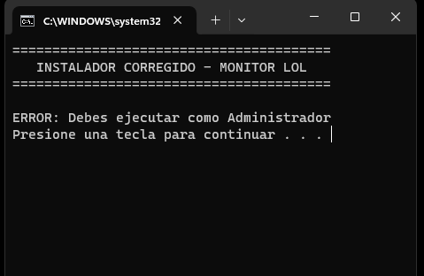
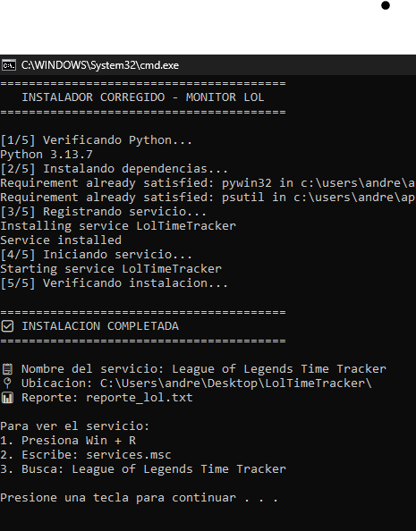
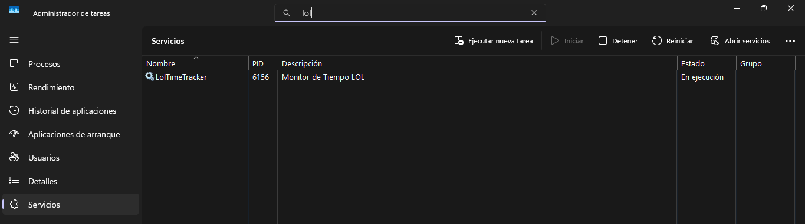
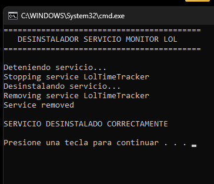

# 🎮 LOL Time Tracker - Monitor de Horas de Juego

## Servicio en ejecución en Windows Services

---

## 📋 Descripción
LOL Time Tracker es un servicio para Windows que monitorea y registra automáticamente el tiempo de juego en League of Legends. Funciona en segundo plano como un servicio del sistema, generando reportes detallados en español sobre los hábitos de juego.

---

## ✨ Características Principales
- ✅ Detección automática de League of Legends y Riot Client
- ✅ Conteo inteligente por sesiones y acumulado diario
- ✅ Reportes en español fáciles de entender
- ✅ Servicio Windows (se ejecuta en segundo plano)
- ✅ Historial de 30 días con estadísticas semanales
- ✅ Reset automático diario a medianoche
- ✅ Bajo consumo de recursos del sistema

---

## 📁 Estructura de Archivos
```
LolTimeTracker/
├── lol_monitor.py          # Servicio principal (Python)
├── install_service.bat     # Instalador del servicio
├── uninstall_service.bat   # Desinstalador del servicio
├── generar_reporte.bat     # Consulta de reportes
├── lol_time_data.json      # Datos técnicos (auto-generado)
└── reporte_lol.txt         # Reporte usuario (auto-generado)
```

### 📊 Descripción Detallada de Archivos
| Archivo                | Tipo         | Descripción                                      |
|------------------------|--------------|--------------------------------------------------|
| lol_monitor.py         | Ejecutable   | Servicio principal en Python                     |
| install_service.bat    | Instalador   | Instala el servicio como administrador           |
| uninstall_service.bat  | Desinstalador| Remueve el servicio y archivos                   |
| generar_reporte.bat    | Utilidad     | Muestra reportes de tiempo jugado                |
| lol_time_data.json     | Datos        | Base de datos técnica (generado automático)      |
| reporte_lol.txt        | Reporte      | Reporte legible en español (generado automático) |

---

## 🛠️ Requisitos del Sistema
- **Sistema Operativo:** Windows 10 o 11
- **Python:** Versión 3.8 o superior
- **Memoria RAM:** Mínimo 2GB disponible
- **Permisos:** Administrador para instalación

---

## ⚠️ Requisitos Previos
- Python instalado desde [python.org](https://www.python.org/)
- Marcar opción "Add Python to PATH" durante instalación
- Permisos de administrador en el equipo



---

## 📥 Manual de Instalación Completo

### 🔹 Paso 1: Preparación del Entorno
1. Crear carpeta `C:\LolTimeTracker\`
2. Descargar todos los archivos en la carpeta
3. Verificar que Python esté instalado:
   ```cmd
   python --version
   ```

### 🔹 Paso 2: Instalación del Servicio
1. Hacer clic derecho en `install_service.bat`
2. Seleccionar "Ejecutar como administrador"
3. Esperar que complete los 5 pasos de instalación
4. Confirmar que finalice con "INSTALACION COMPLETADA"



### 🔹 Paso 3: Verificación de Instalación
1. Presionar `Win + R`
2. Escribir `services.msc`
3. Buscar: "League of Legends Time Tracker"
4. Verificar que el estado sea "En ejecución"



---

## 🎮 Uso del Programa

### ▶️ Inicio Automático
El servicio se inicia automáticamente con Windows y requiere cero intervención del usuario.

### 📊 Consulta de Reportes
1. Doble clic en `generar_reporte.bat`
2. Ver el reporte resumido en la ventana
3. Opcional: Presionar `S` para abrir reporte completo
4. Opcional: Presionar `N` para solo ver resumen

---

## 📋 Ejemplo de Reporte Generado


```
📊 REPORTE DE TIEMPO - LEAGUE OF LEGENDS
==================================================
🎮 Tiempo jugado HOY: 3.5 horas (2 sesiones)
📅 Fecha del reporte: 15/01/2024 16:30
📈 Tiempo total esta SEMANA: 12.5 horas
==================================================
📅 HISTORIAL RECIENTE:
   15/01: 3.5 horas
   14/01: 4.0 horas
   13/01: 4.5 horas

⚠️  Este reporte se actualiza automáticamente
📍 Servicio: Monitor de Tiempo LOL
```

---

## 🔧 Comandos Avanzados de Mantenimiento
- **Reiniciar servicio manualmente:**
  ```cmd
  python lol_monitor.py stop
  python lol_monitor.py start
  ```
- **Ver estado detallado del servicio:**
  ```cmd
  sc query LolTimeTracker
  ```
- **Forzar actualización de reporte:**
  ```cmd
  python lol_monitor.py restart
  ```

---

## 🗑️ Proceso de Desinstalación
1. Hacer clic derecho en `uninstall_service.bat`
2. Seleccionar "Ejecutar como administrador"
3. Esperar que complete los 3 pasos de desinstalación
4. Opcional: Eliminar la carpeta manualmente



---

## ❌ Solución de Problemas Comunes
- **Error:** "Python no reconocido"
  ```cmd
  # Descargar e instalar Python desde python.org
  # Marcar "Add Python to PATH" durante instalación
  ```
- **Error:** "Dependencias faltantes"
  ```cmd
  pip install pywin32 psutil
  ```
- **Servicio no inicia automáticamente:**
  ```cmd
  sc config LolTimeTracker start=auto
  sc start LolTimeTracker
  ```
- **Servicio no aparece en services.msc:**
  - Reinstalar como administrador
  - Reiniciar computadora (solo si persiste el problema)

---

## 📝 Notas Técnicas Importantes
- ⚠️ No mover los archivos después de instalar
- ⚠️ No renombrar los archivos .bat o .py
- ✅ El servicio detecta: LeagueClient.exe, RiotClient.exe
- ✅ Los datos se pierden si desinstalas sin hacer backup
- ✅ Recomendado: Copia periódica de lol_time_data.json

---

## 🆘 Soporte y Troubleshooting
**Síntomas y Soluciones:**
- ❌ Servicio no aparece
  - Ejecutar `install_service.bat` como administrador
  - Verificar que Python esté en PATH
- ❌ Reporte no se genera
  - Verificar que el servicio esté "En ejecución"
  - Jugar League of Legends al menos 5 minutos
- ❌ Error de dependencias
  - Ejecutar: `pip install pywin32 psutil`
- ❌ Acceso denegado
  - Siempre ejecutar .bat como administrador

---

## 📄 Información Técnica Adicional
- **Nombre del Servicio:** LolTimeTracker
- **Nombre para mostrar:** League of Legends Time Tracker
- **Tipo de inicio:** Automático
- **Dependencias:** Python 3.8+, pywin32, psutil
- **Archivo de configuración:** lol_time_data.json


---

<div align="center">
	<b>✨ OCHOA ORTEGA ANDREA J.</b><br>
	<br>
	<sub>Computación Tolerante a Fallas D06.</sub><br>
	<br>
	
	
	<br>
	<i>“Lo que esta bien hecho no se va a romper.”</i>
</div>

